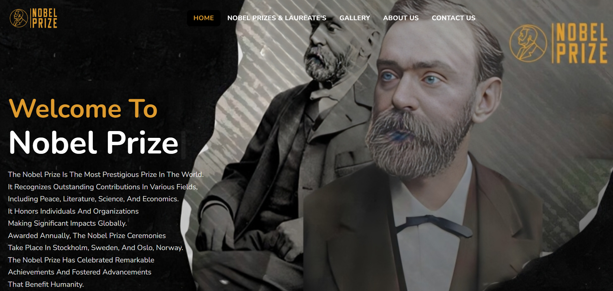

# Nobel Prize Website

    <h3>Project Summary</h3>
    

        This project is a <strong>Nobel Prize Website</strong>, developed using <strong>HTML</strong>,
        <strong>CSS</strong>, and <strong>JavaScript</strong>.
        The website provides comprehensive information about Nobel Prize winners, their achievements, and categories
        such as:
    

    <ul>
        <li>Physics</li>
        <li>Chemistry</li>
        <li>Medicine</li>
        <li>Literature</li>
        <li>Peace</li>
        <li>Economic Sciences</li>
    </ul>
    
It also includes additional sections such as:

    <ul>
        <li>Gallery featuring images of Nobel Prize winners</li>
        <li>News section with updates on Nobel Prize-related events</li>
        <li>Videos highlighting notable Nobel laureates</li>
    </ul>
     
    <h3>Features</h3>
    
This project was developed to apply and enhance my knowledge of <strong>HTML</strong>, <strong>CSS</strong>, and
        <strong>JavaScript</strong>.

    
If interested, the project website can be accessed through the following link:

 

    

